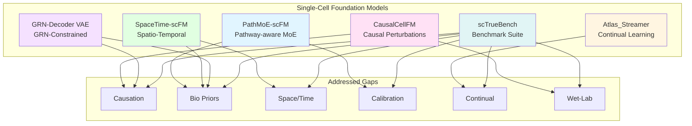
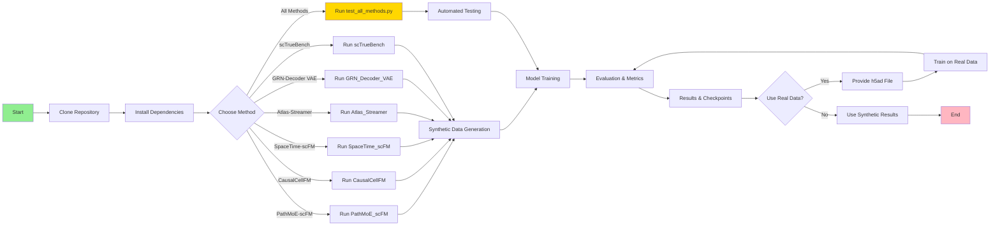
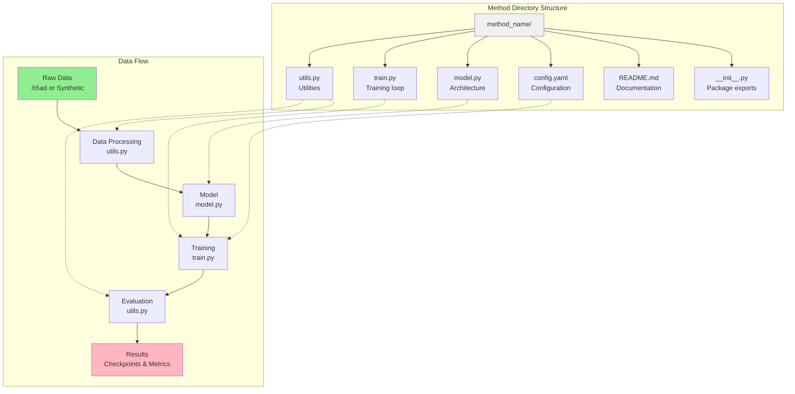

# Single-Cell Foundation Models (scFM)

Six novel methods for single-cell foundation model research, addressing critical gaps in causal reasoning, biological priors, spatio-temporal context, calibration, continual learning, and experimental validation.

## 🚀 Overview

This repository implements state-of-the-art foundation models for single-cell genomics that go beyond current approaches by incorporating biological priors, causal reasoning, and comprehensive evaluation frameworks. Each method is modular, well-documented, and tested with synthetic data for immediate validation.

## 🏗️ Architecture Overview



## 📦 Methods

| Method | Description | Gaps Addressed |
|--------|-------------|----------------|
| **PathMoE-scFM** | Pathway-aware sparse mixture-of-experts transformer | Biological priors, Calibration |
| **CausalCellFM** | Counterfactual perturbation foundation model | Causation, Wet-lab validation |
| **SpaceTime-scFM** | Spatio-temporal multi-modal foundation model | Spatial/temporal context, Biological priors |
| **Atlas-Streamer** | Continual learning for atlas updates | Continual learning |
| **GRN-Decoder VAE** | GRN-constrained generative foundation model | Causation, Biological priors |
| **scTrueBench** | Causal benchmark suite | All gaps (comprehensive evaluation) |

## 🔧 Installation

```bash
# Clone the repository
git clone https://github.com/raktim-mondol/single-cell-foundation-models.git
cd single-cell-foundation-models

# Install dependencies
pip install -r requirements.txt
```

### Requirements

- Python 3.8+
- PyTorch 1.10+
- NumPy
- SciPy
- (Optional) scanpy, anndata for real data processing

## 🏃 Quick Start

### Test All Methods

```bash
# Run comprehensive tests on all methods
python test_all_methods.py --method all

# Test specific method
python test_all_methods.py --method PathMoE_scFM

# Quick test mode (reduced data/epochs)
python test_all_methods.py --method all --quick
```

### Run Individual Methods

Each method can be run independently with synthetic data:

```bash
# PathMoE-scFM
cd PathMoE_scFM
python train.py --n_genes 2000 --n_cells 5000 --pretrain_epochs 20 --finetune_epochs 10

# CausalCellFM
cd CausalCellFM
python train.py --n_genes 1000 --n_cells 3000 --epochs 20

# SpaceTime-scFM
cd SpaceTime_scFM
python train.py --n_genes 500 --n_cells 2000 --spatial_dim 2 --epochs 20

# Atlas-Streamer
cd Atlas_Streamer
python train.py --n_releases 5 --cells_per_release 500 --update_steps 100

# GRN-Decoder VAE
cd GRN_Decoder_VAE
python train.py --n_genes 200 --n_cells 2000 --grn_density 0.03 --epochs 30

# scTrueBench
cd scTrueBench
python run_benchmark.py --n_cells 500 --n_genes 200
```

### Use as Python Packages

```python
# PathMoE-scFM
from PathMoE_scFM import PathMoEscFM

model = PathMoEscFM(
    n_genes=2000,
    n_experts=50,
    d_model=128
)

# CausalCellFM
from CausalCellFM import CausalCellFM

model = CausalCellFM(
    n_genes=1000,
    d_model=128,
    n_batches=5
)

# SpaceTime-scFM
from SpaceTime_scFM import SpaceTimescFM

model = SpaceTimescFM(
    n_genes=500,
    d_model=128,
    spatial_dim=2
)

# Atlas-Streamer
from Atlas_Streamer import AtlasStreamer, SimpleScFMBackbone

backbone = SimpleScFMBackbone(n_genes=500, d_model=64)
streamer = AtlasStreamer(backbone, buffer_capacity=5000)

# GRN-Decoder VAE
from GRN_Decoder_VAE import GRNDecoderVAE

model = GRNDecoderVAE(
    n_genes=200,
    d_model=64,
    grn_adj=your_grn_matrix
)

# scTrueBench
from scTrueBench import ScTrueBench, BenchmarkData

bench = ScTrueBench(benchmark_data)
results = bench.run(model_name="YourModel", embeddings=embeddings, ...)
```

## 📚 Documentation

### Method-Specific Documentation

Each method includes comprehensive documentation:

- [PathMoE-scFM Documentation](PathMoE_scFM/README.md)
- [CausalCellFM Documentation](CausalCellFM/README.md)
- [SpaceTime-scFM Documentation](SpaceTime_scFM/README.md)
- [Atlas-Streamer Documentation](Atlas_Streamer/README.md)
- [GRN-Decoder VAE Documentation](GRN_Decoder_VAE/README.md)
- [scTrueBench Documentation](scTrueBench/README.md)

### Configuration Files

Each method includes a `config.yaml` file for easy parameter customization:

```yaml
# PathMoE_scFM/config.yaml
model:
  n_genes: 2000
  n_experts: 50
  d_model: 128

training:
  pretrain_epochs: 20
  batch_size: 64
  lr: 1.0e-4
```

## 🔄 Workflow Diagram



## 🧪 Testing

### Modular Structure

Each method follows a consistent modular architecture:



### Synthetic Data Testing

All methods include built-in synthetic data generators for immediate testing without requiring external datasets:

- **PathMoE-scFM**: Negative binomial expression with pathway memberships
- **CausalCellFM**: Perturb-seq style data with control/perturbation pairs
- **SpaceTime-scFM**: Spatial transcriptomics with coordinates and pseudotime
- **Atlas-Streamer**: Streaming atlas releases with growing vocabularies
- **GRN-Decoder VAE**: GRN-constrained expression data
- **scTrueBench**: Comprehensive benchmark data with multiple axes

### Real Data Integration

Each method supports real data via AnnData format:

```bash
python train.py --h5ad your_data.h5ad --n_genes 2000
```

## 🔬 Research Context

### Addressed Gaps in Current scFMs

This work addresses six critical gaps in current single-cell foundation models:

1. **Causation**: Models learn correlations, not causal relationships
2. **Biological Priors**: Gene regulatory knowledge is discarded
3. **Spatial/Temporal Context**: Position and time are ignored
4. **Calibration**: Uncertainty quantification is poorly calibrated
5. **Continual Learning**: Models don't adapt to streaming data
6. **Wet-Lab Validation**: Lack of experimental validation

### Citation

If you use this code in your research, please cite:

```bibtex
@software{single_cell_foundation_models,
  title={Single-Cell Foundation Models: Novel Methods for Causal Reasoning and Biological Priors},
  author={Mondol, Raktim},
  year={2025},
  url={https://github.com/raktim-mondol/single-cell-foundation-models}
}
```

## 🤝 Contributing

Contributions are welcome! Please follow these guidelines:

1. Fork the repository
2. Create a feature branch (`git checkout -b feature/amazing-feature`)
3. Make your changes and add tests
4. Run the test suite (`python test_all_methods.py`)
5. Commit your changes (`git commit -m 'Add amazing feature'`)
6. Push to the branch (`git push origin feature/amazing-feature`)
7. Open a Pull Request

### Development Guidelines

- Follow the existing modular structure (model.py, train.py, utils.py)
- Add documentation for new components
- Include synthetic data generation for testing
- Update configuration files accordingly
- Ensure all tests pass before submitting PRs

## 📁 Project Structure

```
single_cell_genomics/
├── README.md                      # Main documentation
├── requirements.txt               # Python dependencies
├── test_all_methods.py           # Universal test runner
│
├── PathMoE_scFM/                 # Pathway-aware MoE transformer
│   ├── __init__.py
│   ├── README.md
│   ├── config.yaml
│   ├── model.py
│   ├── train.py
│   └── utils.py
│
├── CausalCellFM/                 # Causal perturbation model
│   ├── __init__.py
│   ├── README.md
│   ├── config.yaml
│   ├── model.py
│   ├── train.py
│   └── utils.py
│
├── SpaceTime_scFM/               # Spatio-temporal model
│   ├── __init__.py
│   ├── README.md
│   ├── config.yaml
│   ├── model.py
│   ├── train.py
│   └── utils.py
│
├── Atlas_Streamer/               # Continual learning framework
│   ├── __init__.py
│   ├── README.md
│   ├── config.yaml
│   ├── model.py
│   ├── train.py
│   └── utils.py
│
├── GRN_Decoder_VAE/              # GRN-constrained VAE
│   ├── __init__.py
│   ├── README.md
│   ├── config.yaml
│   ├── model.py
│   ├── train.py
│   └── utils.py
│
└── scTrueBench/                  # Benchmark suite
    ├── __init__.py
    ├── README.md
    ├── config.yaml
    ├── benchmark.py
    ├── run_benchmark.py
    └── utils.py
```

## 🐛 Troubleshooting

### Common Issues

**CUDA Out of Memory**: Reduce batch size or model dimensions in config files

**Import Errors**: Ensure all dependencies are installed: `pip install -r requirements.txt`

**Synthetic Data Quality**: Adjust random seed or data generation parameters in utils.py

**Gradient Errors**: Check that you're using PyTorch 1.10+ and that models are in training mode

## 📄 License

This project is licensed under the MIT License - see the LICENSE file for details.

## 🙏 Acknowledgments

- Built upon insights from scVI, SCANPY, Seurat, scIB, scBERT, Geneformer, scGPT, HLCA, and HCA
- Synthetic data generation inspired by established single-cell simulation methods
- Evaluation frameworks adapted from scIB and causal inference literature

## 📧 Contact

For questions, issues, or suggestions:
- Open an issue on GitHub
- Contact: dr.raktim.mondol@gmail.com

---

**Note**: This is a research repository. Methods are provided as-is for academic and research purposes. For clinical applications, please ensure proper validation and regulatory compliance.